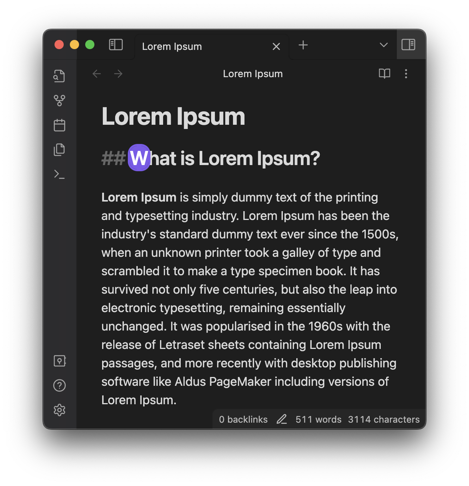
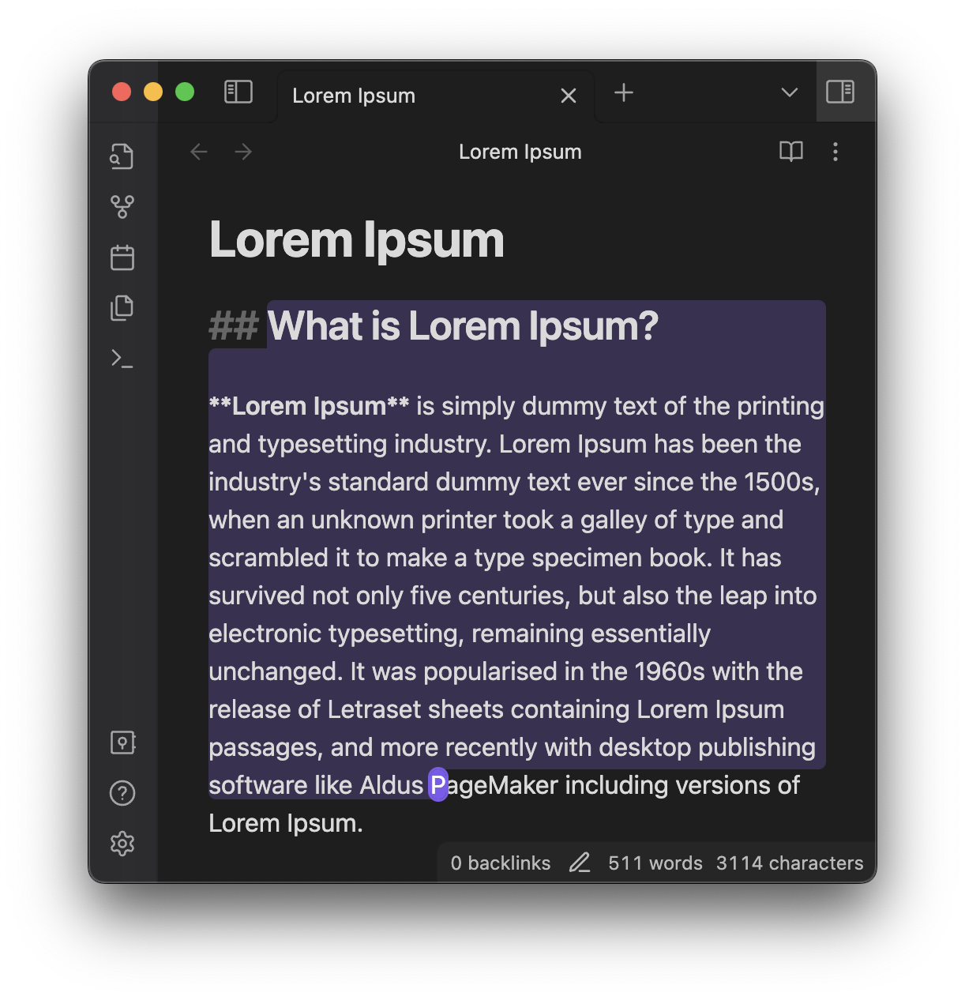

<h1 align="center">
Smoorth
</h1>

Replaces the default [Obsidian](https://obsidian.md/) caret with a smooth and round one. Works only with enabled Vim mode during editing.

 
 
 

## Features

- Smooth caret which stops blinking after 20 iterations.
- Round selection.

## Related

- Based on the default selection [extension](https://github.com/codemirror/view/blob/main/src/draw-selection.ts). The actual code is a bit transformed into a functional style while the cursor is fully based on Obsidian's one.
- [The blink animation](https://easings.net/#easeInOutCirc).

## Releasing new releases

- Update your `manifest.json` with your new version number, such as `1.0.1`, and the minimum Obsidian version required for your latest release.
- Update your `versions.json` file with `"new-plugin-version": "minimum-obsidian-version"` so older versions of Obsidian can download an older version of your plugin that's compatible.
Create a new GitHub release using your new version number as the "Tag version". Use the exact version number, don't include a prefix `v`. See here for an example: <https://github.com/obsidianmd/obsidian-sample-plugin/releases>
- Upload the files `manifest.json`, `main.js`, `styles.css` as binary attachments. Note: The manifest.json file must be in two places, first the root path of your repository and also in the release.
- Publish the release.

> You can simplify the version bump process by running `npm version patch`, `npm version minor` or `npm version major` after updating `minAppVersion` manually in `manifest.json`.
> The command will bump version in `manifest.json` and `package.json`, and add the entry for the new version to `versions.json`

## Adding your plugin to the community plugin list

- Check <https://github.com/obsidianmd/obsidian-releases/blob/master/plugin-review.md>
- Publish an initial version.
- Make sure you have a `README.md` file in the root of your repo.
- Make a pull request at <https://github.com/obsidianmd/obsidian-releases> to add your plugin.

## How to use

- Clone this repo.
- `pnpm install` to install dependencies
- `pnpm dev` to start compilation in watch mode.

## Manually installing the plugin

- Copy over `main.js`, `styles.css`, `manifest.json` to your vault `VaultFolder/.obsidian/plugins/your-plugin-id/`.

## API Documentation

See <https://github.com/obsidianmd/obsidian-api>
